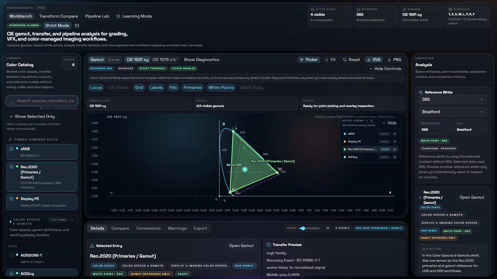
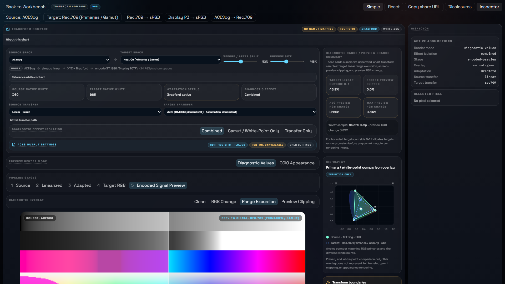
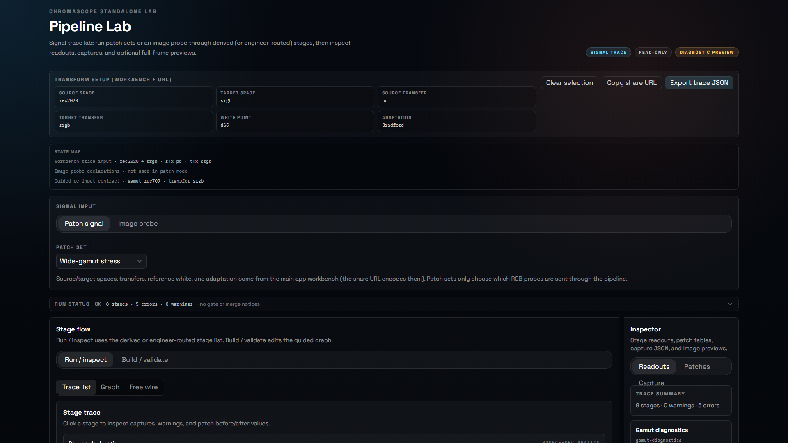
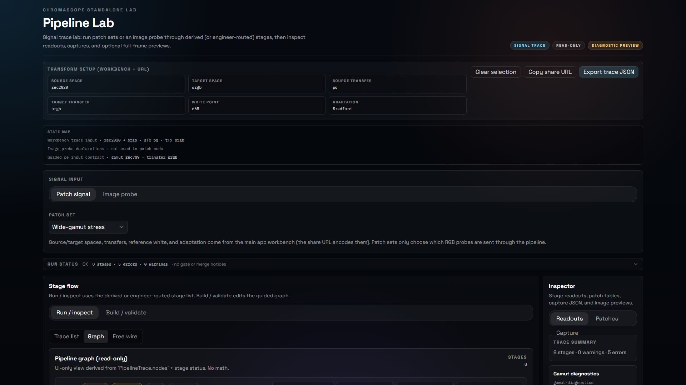
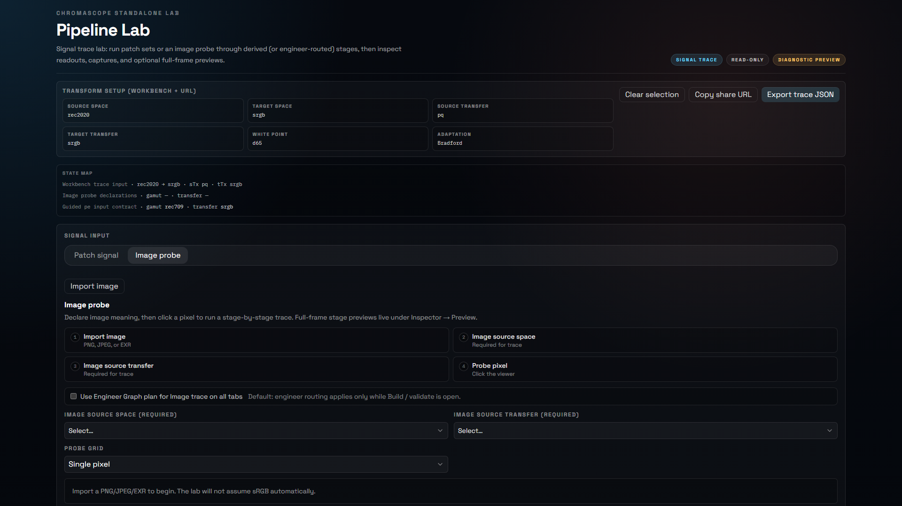
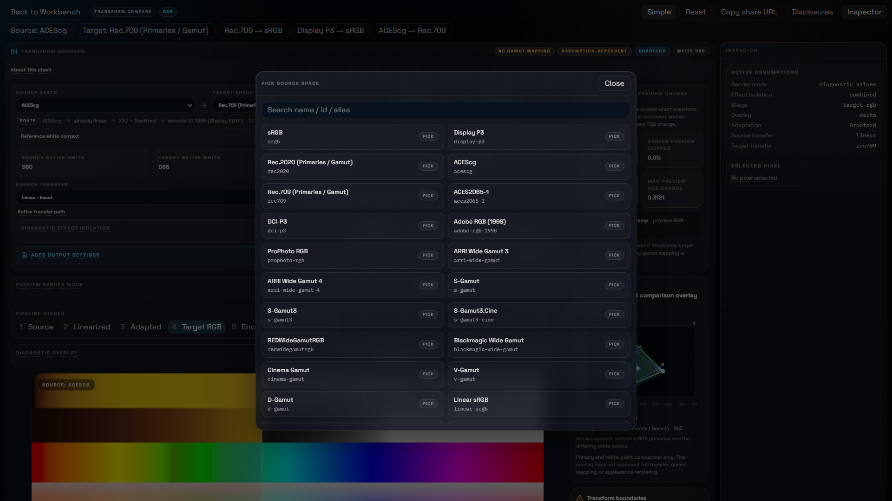

# 🎨 ChromaScope

**Technical color-analysis tool for RGB spaces, transfer curves, gamut geometry, and diagnostic pipeline views.**

> 🔒 Private source — this repository is a project showcase.

---

## 🎯 The Problem It Solves

Most color tools either oversimplify or conflate distinct concepts under one label. ChromaScope is built around a stricter rule: **a gamut is not a transfer curve, a transfer curve is not a delivery system, and a pipeline diagram is not a rendered image.**

ChromaScope keeps those boundaries visible while still letting you compare everything in one workspace.

---

## 🔬 What It Analyzes

- 📐 CIE gamut geometry and chromaticity relationships
- 🎨 RGB primaries, white points, and gamut fills
- 📈 Transfer curves and log encodings — SDR, HDR, gamma, log, camera models
- 🔄 Chromatic adaptation (Bradford and others)
- 🔗 Pipeline roles and staged transform workflows
- 🖼️ Image-based diagnostic transform previews with pixel inspection

### Concept Classes (kept explicitly distinct)

| Class | Examples |
|:---|:---|
| 🎨 Gamut / primaries | sRGB, Rec.2020, ACEScg, DCI-P3, camera gamuts |
| 📈 Transfer functions | sRGB, PQ/ST 2084, HLG, ACEScc, ACEScct, BT.1886 |
| 🔄 Chromatic adaptation | Bradford, D65 ↔ D60, white-point shifts |
| 🔗 Pipeline stages | source encoding → working space → output transform → delivery |
| 📡 Signal encodings | log, linear, scene-referred vs display-referred |

---

## 🖥️ Viewer Modes

**🗺️ Gamut View** — Chromaticity geometry on CIE 1931 xy and CIE 1976 u'v'. Overlays: spectral locus, black-body locus, gamut fills, area comparisons.

**📈 Curve View** — Transfer behavior across curve families — forward and inverse, selectable axis contracts (signal, code values, linear, stops, or nits).

**⚖️ Dual View** — Gamut and curve analysis side by side without pretending they are the same property.

**🔗 Pipeline View** — Staged transform walkthrough: source encoding → working-space transform → adaptation → display transform → delivery context.

**🖼️ Image Pipeline View** — A diagnostic chart previewed through a full source → target transform chain. Overlays: Clean, Delta, Out of Gamut, Clipping.

**🧊 CIE 3D Viewers** — Standalone CIE xyY and CIE XYZ 3D viewers. Interactive with drag-to-inspect, spectral locus, and reference planes.

**🔀 Transform Compare** — Side-by-side source and target space picker with diagnostic output.

**📚 Learning Mode** — Guided explanations tied to the active viewer context.

---

## 📸 Screenshots

**Workbench overview**

**Transform Compare — diagnostic output**

**Pipeline Lab — trace view**

**Pipeline Lab — graph view**

**Pipeline Lab — image probe mode**

**Transform Compare — source picker**

---

## 🛠️ Tech Stack

| Layer | Technology |
|:---|:---|
| Language | TypeScript |
| Frontend | React 18 + Vite (multi-page build) |
| Desktop shell | Tauri v2 (Rust) |
| Color math | Custom `src/lib/color/` — matrix derivation, XYZ/xy/u'v', adaptation, curve modeling |
| OCIO / ACES | OpenColorIO config integration |
| UI components | shadcn/ui + custom design system |
| Testing | Playwright end-to-end |

---

## 👥 Who It's For

- 🎨 Colorists and finishing artists comparing delivery targets
- 🎬 VFX and CG artists working in ACES or ACEScg pipelines
- 🔬 Imaging engineers validating transform behavior
- ⚙️ Technical directors and pipeline developers
- 📚 Students learning color science with a technically honest reference

---

## 📊 Status

Active development. 🔒 Private source — this repository is a project showcase.
